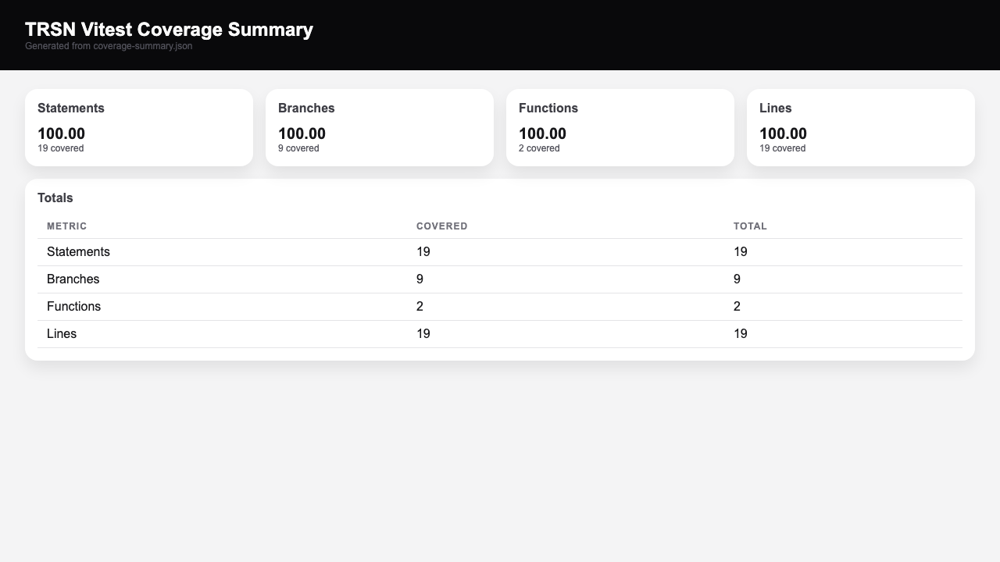
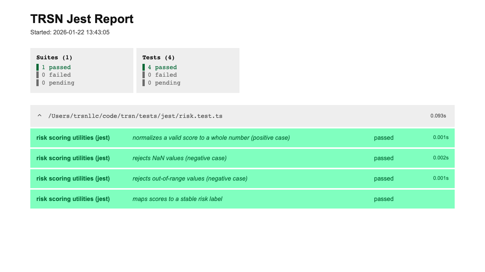
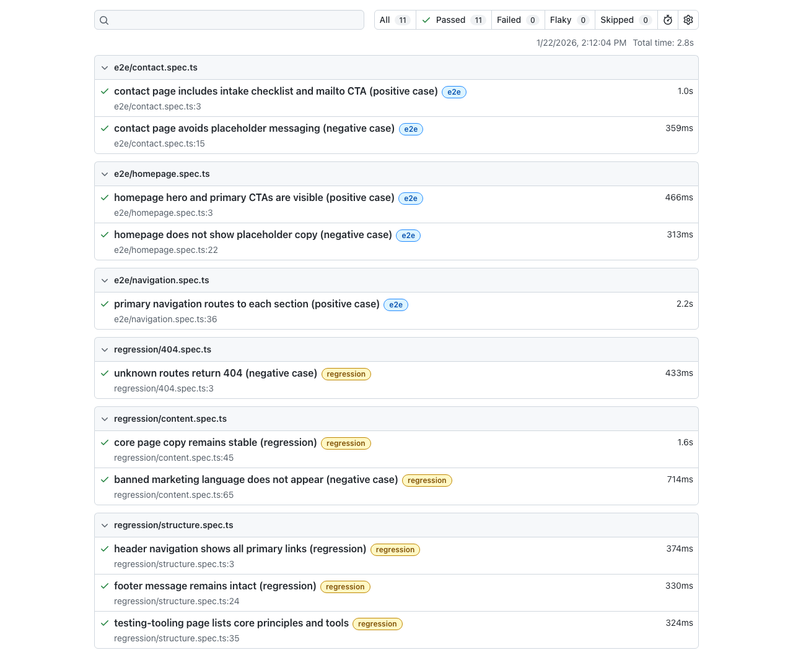
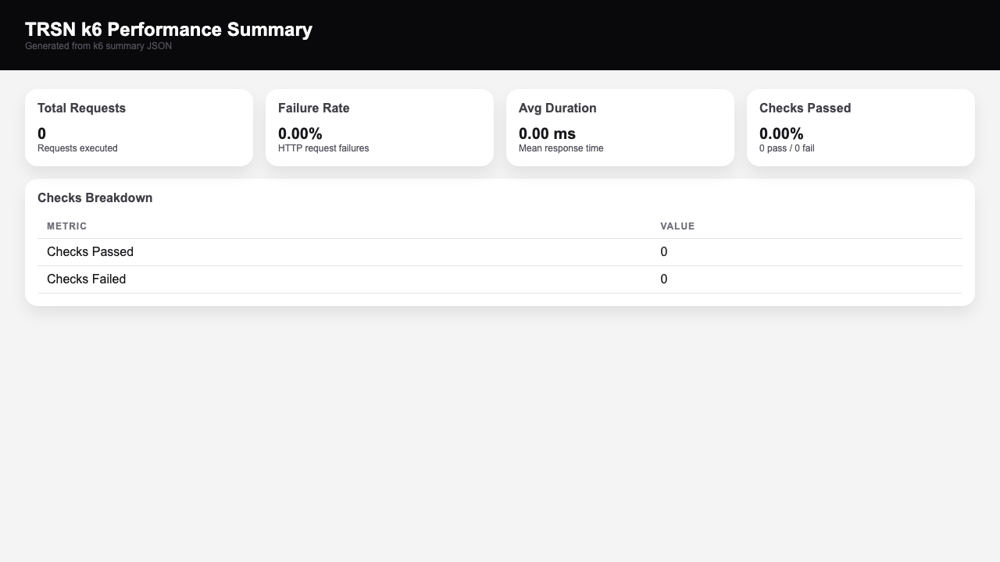
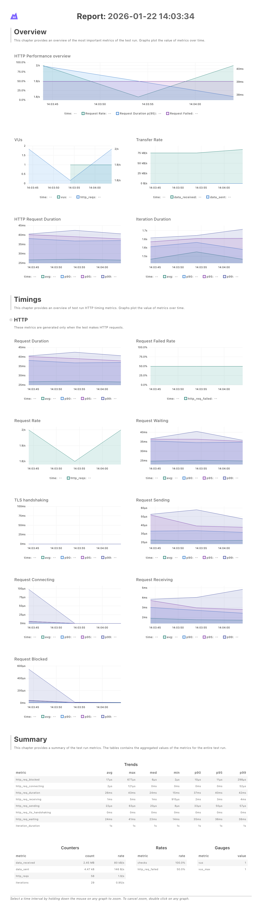

This repository powers **TRSNLLC.com**, the public authority site for **TRSN LLC**. It is a Next.js app (App Router) with Tailwind CSS and a small, intentional surface area.

Core goals:

- Educate technical leaders and QA orgs.
- Demonstrate QAAS (Quality Assurance as a Service) and MASS (Models -> Agents -> Skills).
- Serve as a live, inspectable demo of agent-governed systems.

See `AGENTS.md` for the operating contract and content rules.

## Getting Started

First, run the development server:

```bash
npm run dev
# or
yarn dev
# or
pnpm dev
# or
bun dev
```

Open [http://localhost:3000](http://localhost:3000) with your browser to see the result.

You can start editing the page by modifying `app/page.tsx`. The page auto-updates as you edit the file.

## Tech Stack

- Next.js (App Router)
- React 19
- Tailwind CSS v4 (via `@tailwindcss/postcss`)
- TypeScript
- React Compiler enabled in `next.config.ts`

## Scripts

```bash
npm run dev     # start local dev server
npm run build   # production build
npm run start   # run production server
npm run lint    # eslint
npm run format  # prettier formatting
npm run test:vitest      # vitest + coverage report
npm run test:jest        # jest + html report + coverage
npm run test:playwright  # playwright ui automation + html report
npm run test:k6          # k6 smoke test + html report
```

The repository also includes a `.husky/pre-commit` hook that runs `./scripts/pre-commit.sh` (which currently invokes `npm run lint`) before each commit.

## Testing

See `TESTING.md` for setup, reporting locations, and tool-specific notes.

## Report Samples

These are captured outputs from the test suites so clients can see real reporting artifacts.







## Project Structure

```text
app/            # app router pages, layout, globals
public/         # static assets
AGENTS.md        # governance + content rules
```

## Governance

This project is governed by `AGENTS.md`. If you are contributing content or pages, read it first.

## Learn More

To learn more about Next.js, take a look at the following resources:

- [Next.js Documentation](https://nextjs.org/docs) - learn about Next.js features and API.
- [Learn Next.js](https://nextjs.org/learn) - an interactive Next.js tutorial.

You can check out [the Next.js GitHub repository](https://github.com/vercel/next.js) - your feedback and contributions are welcome!

## Deploy on Vercel

The easiest way to deploy your Next.js app is to use the [Vercel Platform](https://vercel.com/new?utm_medium=default-template&filter=next.js&utm_source=create-next-app&utm_campaign=create-next-app-readme) from the creators of Next.js.

Check out our [Next.js deployment documentation](https://nextjs.org/docs/app/building-your-application/deploying) for more details.
